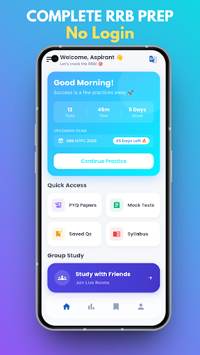
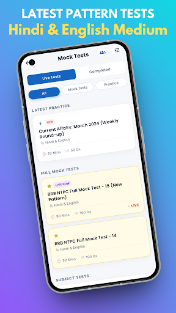
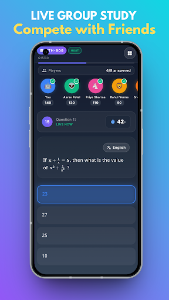
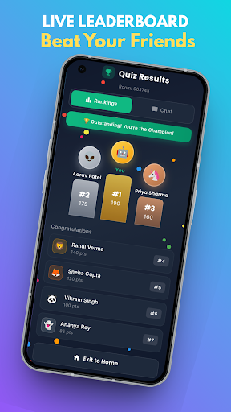
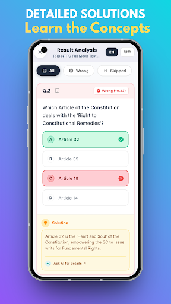
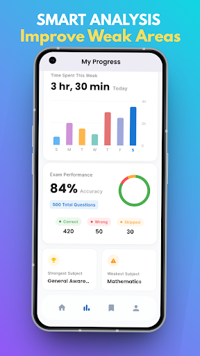
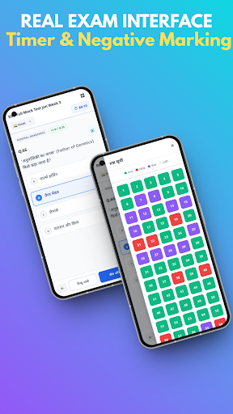
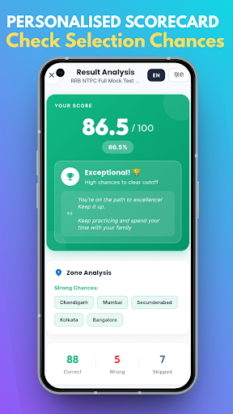

# 🚀 Careertrack | Advanced Flutter Application

A highly optimized, production-grade Flutter application designed for exam preparation. This project moves beyond standard CRUD operations, implementing **real-time multiplayer environments**, **offline-first caching strategies**, and **advanced background synchronization**.

## 🧠 Engineering & Architectural Highlights

This application was engineered with a focus on **performance**, **cost-efficiency**, and **scalability**. 

### 1. Smart Bandwidth Optimization (HTTP 304)
To minimize Cloudflare R2 CDN costs and reduce user data consumption, the app utilizes strict `If-Modified-Since` headers. Heavy JSON files are only downloaded if the server confirms a modification. Otherwise, the app seamlessly serves the test data from the local `Hive` cache.

### 2. Custom Real-Time Multiplayer (MQTT)
Instead of relying on expensive managed services like Firebase Realtime Database for live features, the "Group Battle" lobby is powered by a custom **MQTT** implementation. 
* **NTP-Style Time Synchronization:** Calculates round-trip time (RTT) and median offsets so all players' timers sync to the exact millisecond, regardless of network latency.
* **Zombie Pruning:** Custom heartbeat tracking automatically detects dropped connections and prunes "zombie" players to keep the lobby state clean.
* **Smart Syncing:** The host cannot initiate a game until a distributed state check confirms all clients have successfully downloaded the required assets.

### 3. Thread-Safe Performance
* **Isolate Parsing:** Massive JSON arrays (test questions and options) are parsed via `compute()` on background threads to ensure the UI maintains a strict 60 FPS without dropping frames.
* **Zero-Jank Timers:** Uses `ValueNotifier` for high-frequency updates (like the exam countdown timer) rather than calling `setState()`, preventing unnecessary widget tree rebuilds.
* **Low-End Device Detection:** Dynamically scales down animations, haptics, and particle effects if a lower-end Android device is detected.

### 4. Resilient Offline-First Architecture
* **Ghost & Piggyback Syncing:** User statistics, analytics, and test histories are cached locally. The app utilizes "Piggyback Syncing" to silently push this data to Firebase during app lifecycle state changes (e.g., when the app is paused) without blocking the user's primary thread.
* **The "Shield Breaker":** A smart throttle usually prevents polling the server more than once an hour. However, when Firebase Remote Config triggers a "New Test" push notification, the app dynamically breaks the throttle to fetch fresh content immediately.

### 5. Seamless Monetization Loop
Google AdMob Rewarded Video is deeply integrated into the core loops. Users can watch ads to permanently upgrade their multiplayer room capacity (from 3 to 10 slots) or unlock premium mock tests, with the upgraded state persisting securely via local storage.

## 🛠️ Tech Stack

* **Frontend:** Flutter & Dart
* **Backend Services:** Firebase (Auth, Firestore, Cloud Messaging, Remote Config)
* **Real-Time Protocol:** MQTT (Mosquitto)
* **Local Storage:** Hive (NoSQL key-value database), SharedPreferences
* **Content Delivery:** Cloudflare R2
* **Monetization:** Google AdMob

## 🏃‍♂️ Getting Started

### Prerequisites
* Flutter SDK (Latest Stable)
* Dart SDK
* Google Services configuration files (`google-services.json` / `GoogleService-Info.plist`)

### Installation
1. Clone the repository:
   `git clone https://github.com/ashmin-saurav/careertrack.git`
2. Navigate to the project directory:
   `cd careertrack`
3. Install dependencies:
   `flutter pub get`
4. Run the app:
   `flutter run`

## 📸 App Previews

  
  
  
  

  
  
  
  

---
*Developed with ❤️ for aspirants aiming to crack the Competitive exams.*
